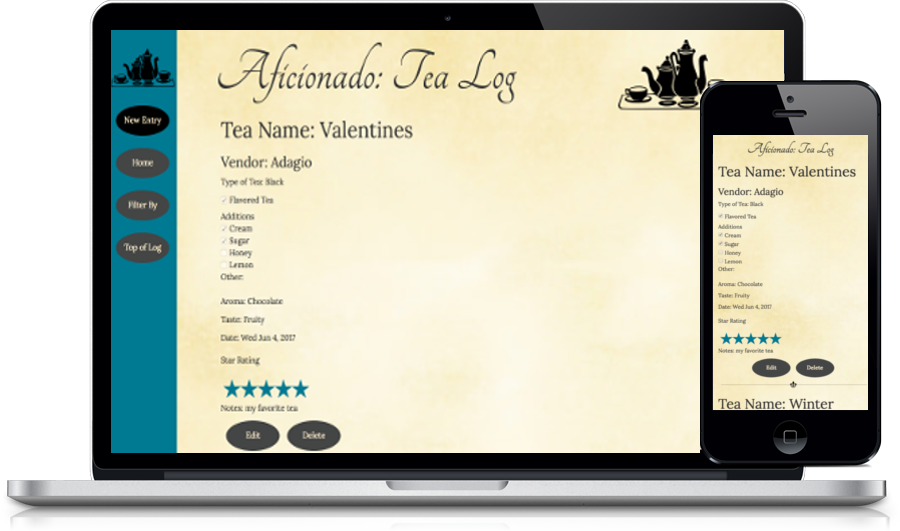

<h1>Tea Log</h1>
<p><a href="https://tealog.herokuapp.com/">Tea Log</a> is a responsive full-stack app that chronicles user experiences with tea.</p>


## Getting started
### Installing
```
>   git clone https://github.com/lulubun/Tealog.git
>   cd Tealog
>   npm install
```
### Launching
```
>   npm start
```
Then open [`localhost:8000`](http://localhost:8000) in a browser.

<h2>Introduction</h2>
<p>This project was inspired by my love of tea. Just like high quality coffee, tea comes in many varieties and flavors that are often unknown here in the United States. Becoming more aware of what kind and the quality of the tea you drink requires you to pay close attention each time you taste a new tea.</p>
<p>Lovers of wine might be familiar with the concept of recording wine tastings. Tea tasting is also something tea lovers will document in a similar manner. If someone wants to become more knowledgeable about something they enjoy, one of the best and easiest ways to improve their expertise is to journal about their experiences.</p>
<p>While I wanted this to be an app that users could fully customize for the documenting of any favorite edible or experience (tea, wine, chocolate, bungie jumping, etc!), for initial production I focused on tea only.</p>
<p>Users can record the different kinds of tea they try, what they add to it, what they smell, taste, and add a star rating. Recording this information over time will help a user to understand the differences between teas.</p>

<h2>Tech Stack</h2>
<ul>
  <li>HTML</li>
  <li>CSS</li>
  <li>JavaScript</li>
  <li>jQuery</li>
  <li>Node.js</li>
  <li>Mongo DB</li>
</ul>

<h3>Responsive</h3>
<ul>
  <li>The app is fully responsive and quickly adapts to all mobile, tablet, and desktop viewports.</li>
</ul>

<h3>Attribution</h3>
<p>Star Rating</p>
<ul>
  <li><a href="https://github.com/prrashi/rateYo">RateYo</a></li>
</ul>  
